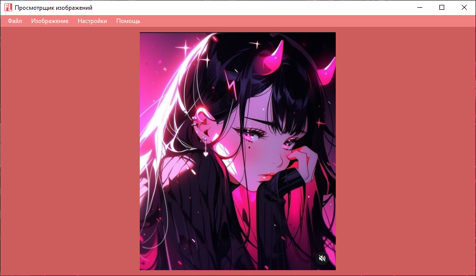
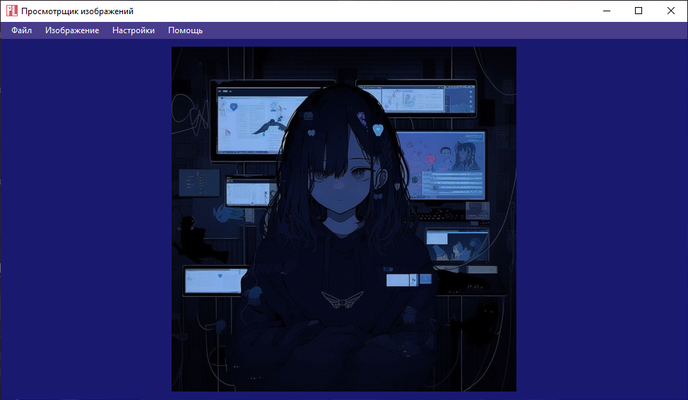
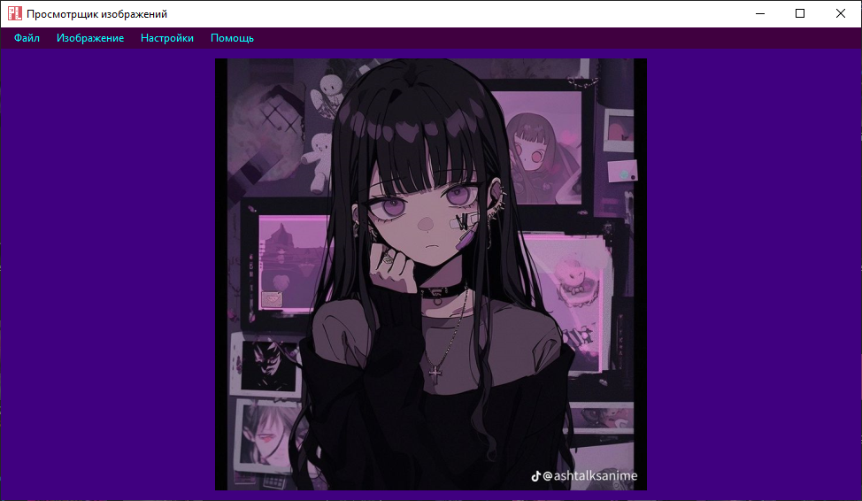

# ViewPictures

I wrote an image viewer in C#.

Figure 1. Screenshot of the main window with an open image in a light theme

Figure 2. Screenshot of the main window with an open image in a dark theme

Figure 3. Import of the theme supplied with the CyberPunk program

## Advantages:
+ Has a user-friendly design;
+ The program is easily closed with the esc button;
+ Supports image rotation;
+ Quick launch;
+ Files are opened not only through the "File->" buttonOpen", but also through dragon drop;
+ If you set the default for viewing images, then everything will work by double-clicking on the image in any directory;
+ It is possible to get information about the image;
+ It is possible to scale the image with the mouse wheel and trackbar;
+ It is possible to crop the image;
+ It is possible to put an image on the desktop;
+ Filters are available that allow you to change the image;
+ The ability to change the screen resolution, which will not be reset after exiting;
+ The ability to create your own themes, export them, as well as import;
+ The theme that you installed last will not disappear even after exiting the program.

## Cons:
- Dependent on Net;
- Not optimized for working with strong image approximation;
- Some filters are unoptimized and slow;
- The image can be cropped when installed on the main screen;
- The ability to change the font is disabled in the creation of the theme for now (or completely);